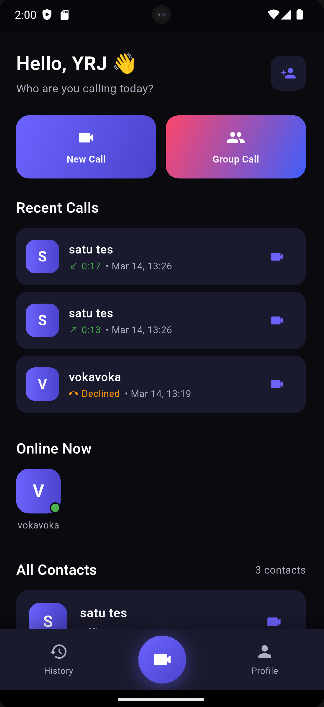
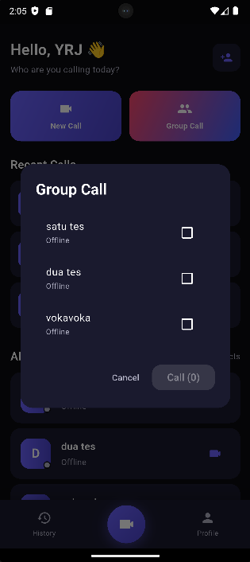
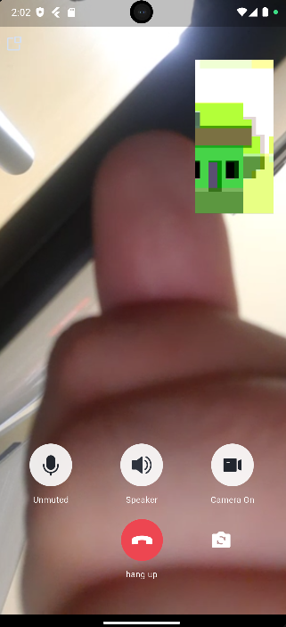

# Pivo Vidcall

Website version (react js) : https://pivo-vidcalls.web.app

A private video calling app built with Flutter. Supports 1-on-1 and group video calls with a simple, fast, and lightweight UI.

> This is a private application. Not intended for public distribution.

---

## Screenshots

<p float="left">
  
  
  
</p>

---

## Getting Started

### Prerequisites

- Flutter SDK (3.x or above)
- Android Studio
- Firebase project
- Tencent RTC (TRTC) account

### Installation

1. **Clone the repository**
   ```bash
   git clone https://github.com/your-username/pivo_vidcall.git
   cd pivo_vidcall
   ```

2. **Install dependencies**
   ```bash
   flutter pub get
   ```

3. **Setup Firebase**
   - Create a Firebase project at [console.firebase.google.com](https://console.firebase.google.com)
   - Enable **Authentication** (Email/Password)
   - Enable **Firestore Database**
   - Download `google-services.json` and place it in `android/app/`
   - Run `flutterfire configure` to generate `lib/firebase_options.dart`

4. **Setup TRTC**
   - Create an app at [console.trtc.io](https://console.trtc.io)
   - Activate the **Call** package
   - Copy your `SDKAppID` and `SecretKey`
   - Update `lib/core/constants/app_constants.dart`:
     ```dart
     static const int trtcAppId = YOUR_SDK_APP_ID;
     static const String trtcSecretKey = 'YOUR_SECRET_KEY';
     ```

5. **Run the app**
   ```bash
   flutter run
   ```

### Build APK

```bash
flutter build apk --release
```

---

## Built With

- [Flutter](https://flutter.dev)
- [Firebase](https://firebase.google.com) — Auth & Firestore
- [Tencent RTC (TRTC)](https://trtc.io) — Video call engine

---

## Security Notice

This project is for private and educational purposes. Some sensitive configurations 
are stored client-side (mobile or web) for development simplicity. Proper server-side handling 
is recommended before any public deployment.

---

*Developed by YRJ & Claude*
